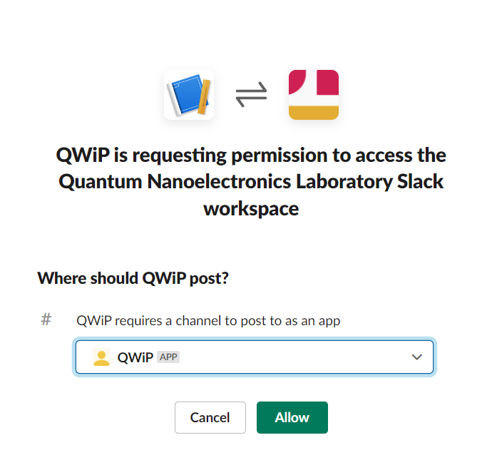

# Workflow Utilities

QWiP provides several helpful utilities for improving the difficult lives of graduate and postdoctoral researchers. These are contained in the `qwip.utils` module and documented below.

## Slack Integration

It is often useful when running longer measurements to get notifications upon completion or error for long measurements. QWiP provides several ways of sending messages to Slack:

Using a context manager:

```python linenums="1"
import time
from qwip.utils import slack_notify

with slack_notify("qwip", message="Task completed") as notify:
    for iteration in range(10):
        time.sleep(1)

        if not iteration%5:
            notify(message=f"Here's an update! We're on iteration {iteration}/10")
```

As a custom IPython [cell magic](https://ipython.readthedocs.io/en/stable/interactive/magics.html):
```python linenums="1"
# Load the extnesion below (1)
%load_ext qwip.utils
%%slack_notify "qwip" -m "Cell completed!"

import time

time.sleep(10)
```

1.  Loading the extension should be done once per session, near the top of your notebook.

In addition to sending messages upon completion, the slack notification cell magic and context manager will catch any exceptions and send the full exception traceback to the channel. This provides immediate notification if an error occured during a long running cell/function.

### Creating a New Webhook

To create a new Slack webhook for use with QWiP, click the "Add to Slack" button below:

<a href="https://slack.com/oauth/v2/authorize?scope=incoming-webhook&amp;user_scope=&amp;redirect_uri=https%3A%2F%2Fqnl-internal.berkeley.edu%2Fqwip-api%2Fregister&amp;client_id=48620956720.2735463917265"></a>

You will be asked to select a channel to post to. We recommend selecting the @QWiP channel so that you don't spam group channels with your messages. If all goes well, you should see a webhook url and the channel selected below after being redirected back to the documentation site.

{ style="width: 100%; max-width: 400px;" }

### Adding a Webhook

!!! success


!!! failure

Now you can add this webhook url to your QWiP configuration. Copy the webhook to your `settings.qwip` file, which should be automatically created for you in the `~/.qwip` folder when you first installed QWiP.

```YAML
...
slack:
    channels:
        ...
        qwip: # (1)
            webhook_url: https://hooks.slack.com/services/team_id/your-new-webhook-identifier
...
```

1. The channel key doesn't need to match the channel name. This name is just an identifier used to select the webhook to use when calling slack_notify.
